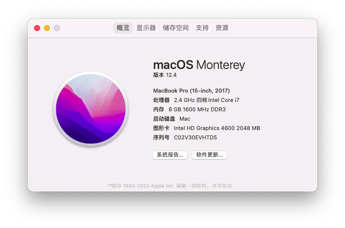
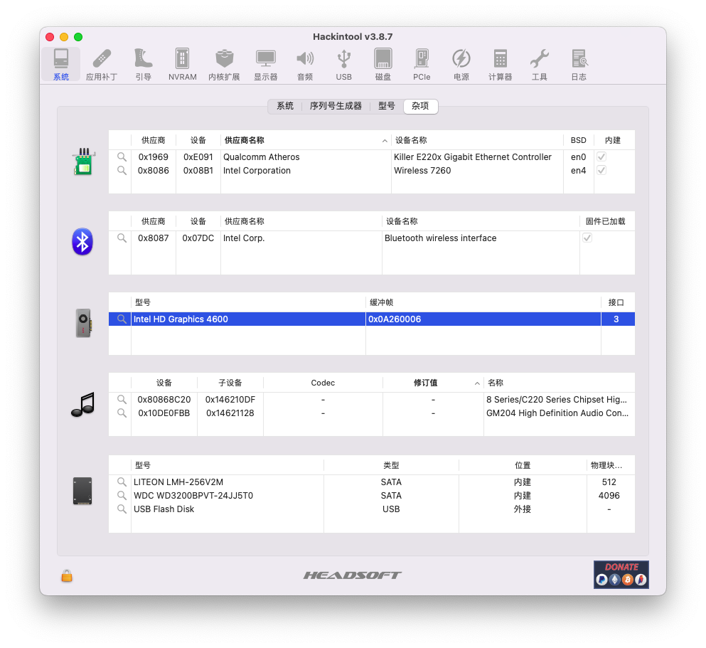

[English](#TODO) | **中文**

# 微星 16F4 笔记本 黑苹果 OpenCore EFI

## 目录
- [微星 16F4 笔记本 黑苹果 OpenCore EFI](#微星-16f4-笔记本-黑苹果-opencore-efi)
  - [目录](#目录)
  - [电脑配置](#电脑配置)
  - [BIOS 设置](#bios-设置)
    - [BIOS 信息](#bios-信息)
    - [关闭](#关闭)
    - [启用](#启用)
  - [启动引导](#启动引导)
  - [内核扩展](#内核扩展)
  - [设备运行情况](#设备运行情况)
    - [正常工作](#正常工作)
    - [不正常工作](#不正常工作)
    - [未测试](#未测试)
  - [鸣谢](#鸣谢)

## 电脑配置

| 规格     | 详细信息                                     |
| -------- | ---------------------------------------- |
| 电脑型号 | 微星16F4 15.6'' |
| 主板 | 微星 MS-16F4 |
| 芯片组 | 英特尔 HM87 |
| 处理器 | 英特尔 酷睿　i7-4700MQ Haswell |
| 内存 | 三星 8GB DDR3L 1600 MHz |
| 硬盘 |光宝　LITEON LMH-256V2M |
| 核心显卡 | 英特尔 超高清显卡 4600 2 GB |
| 独立显卡 | 英伟达 GeForce GTX 970M (MSI)3G|
| 显示器 | 三星 156HL01-104 FHD 1920x1080 (15.6 英寸) |
| 声卡 | 瑞昱 ALC892 |
| 无线网卡 | 英特尔 Wireless-AC 7260 |
| 有线网卡| Rivet Networks Killer E2200 Gigabit Ethernet Controller|
| 触控板 | SYN1507 PS2M Touchpad |
| SD 读卡器 | 瑞昱 RTS5227 |
| 键盘 | PS/2 |

## BIOS 设置
### BIOS 信息
Bios Vendor: American Megatrends

Core Version: 4.6.5.4

Compliancy: UEFI 2.3.1; PI 1.2

Project Version: 16F4A 0.37 x64
### 关闭

快速启动 Fast Boot

- Boot -> Fastboot [**disabled**]

CFG 锁 (MSR 0xE2 写入保护) CFG Lock (MSR 0xE2 write protection)

- Advanced -> Cpu Information -> CFG Lock [**disabled**]

>[This must be off, if you can't find the option then Enabled AppleXcpmCfgLock under Kernel -> Quirks. Your hack will not boot with CFG-Lock Enabledd](https://dortania.github.io/OpenCore-Install-Guide/config-laptop.plist/haswell.html#disable)
### 启用

英特尔虚拟化技术 Intel Virtulalization Technology

- Advanced -> Cpu Information -> Intel Virtulalization Technology [**Enabled**]

 英特尔® 超线程 (HT) 技术 Hyper Threading 

- Advanced -> Cpu Information -> Hyper-threading [**Enabled**]

 英特尔® 处理器执行禁用®位 Execute Disable Bit 

- Advanced -> Cpu Information -> Execute Disable Bit [**Enabled**]

 接手 EHCI 控制 EHCI Hand-off 

- Advanced -> USB Configuration -> EHCI Hand-off [**Enabled**]

 接手 XHCI 控制 XHCI Hand-off 

- Advanced -> USB Configuration -> XHCI Hand-off [**Enabled**]

 UEFI CSM 兼容性支持模块 UEFI with CSM 

- Boot -> Boot mode select [**UEFI with CSM**]

>**必须**开启 CMS,否则导致开机花屏

 分配给DVMT所需要内存大小 DVMT Pre-Allocated 64MB 

- Advanced -> System Agnet(SA) configuration -> Graphics Configruration -> DVMTpre-Allocated [**64MB**]

 

 SATA Mode: AHCI 

- Advanced -> SATA Mode Selection **AHCI** 
- Advanced- > SATA Information -> SATA Mode Selection **AHCI**

## 启动引导
- [ OpenCore 0.80 RELEASE ](https://github.com/acidanthera/OpenCorePkg)

## 内核扩展
| Components    | Version | 
| ------------- | ------ |
| [Lilu]  | 1.6.2 | 
| VirtualSMC | 1.2.9 |
| [CtlnaAHCIPort] | V341.0.2 |
| WhateverGreen | 1.6.0 |
| SMCBatteryManager | 1.2.9 |
| SMCProcessor| 1.5.8 |
| [AppleALC]| 1.7.1 |
| [AtherosE2200Ethernet] | 2.2.2|
| [AirportItlwm] | 2.2.0-alpha | 
| [IntelBluetoothFirmware] | 2.1.0 |
| [BlueToolFixup] | 2.6.1 |
| [USBPorts]| 0.1.1 |
| [RealtekCardReader] | 0.9.6 |
| [RealtekCardReaderFriend] | 1.0.2 |
| [HoRNDIS] | 9.2 |
| VoodooPS2Controller | 2.2.8 |
| BrightnessKeys| 1.0.2 |

## 设备运行情况
### 正常工作
- 核心显卡
- 无线网卡
- 有线网卡
- 声音（alcid=4）
- 麦克风
- 摄像头
- 蓝牙
- 亮度调节
- 电池充电状态

- 声音亮度调节快捷键
- 瑞昱USB SD读卡器

### 不正常工作
- 睡眠 (唤醒比较困难，`OC` 下唤醒方法是：`电源键`唤醒)
- 触摸板 (支持点击与多指手势；左右实体按键不可用)
- **MSI EFP USB** (已禁用)
- **独立显卡** 无法工作
- 风扇转速传感器
- 关闭 CSM 后开机花屏（休眠后唤醒恢复）
### 未测试
- 电源管理
- **HDMI接口** 
  > 开机后第一次接上时可能无法工作，需要重新插拔或者关上盖子等五秒后打开盖子
- DRM
- 隔空投送 / 接力 / 随航
- FaceTime / iMessage

## 鸣谢
- 开发者
- 社区成员
- [黛码小哥哥](https://www.youtube.com/watch?v=k1CrQnPU7yM)
- [黑苹果屋](http://imacos.top/2021/03/23/0906/)
- [黑果小兵部落格](https://blog.daliansky.net/) 
- [国光](https://apple.sqlsec.com/) 
- [远景论坛](http://bbs.pcbeta.com/forum.php)
- [Dortania](https://dortania.github.io/)
- [insanelymac](https://www.insanelymac.com/)
- [RehabMan](https://github.com/RehabMan) 
- [SteFiD93](https://github.com/SteFiD93/ge60-2pe-opencore-bigsur)
- [tonymaiyadx86](https://www.tonymacx86.com)
- [xjn](https://blog.xjn819.com/)
- [xusos](https://github.com/xusos/Hackintosh-EFI) 

[Lilu]: https://github.com/acidanthera/Lilu "Lilu repo"
[CtlnaAHCIPort]: https://github.com/dortania/OpenCore-Install-Guide/blob/master/extra-files/CtlnaAHCIPort.kext.zip "dortania guides repo"
[AppleALC]: https://github.com/acidanthera/AppleALC "AppleALC repo"
[AppleHDADisabler]: https://www.tonymacx86.com/threads/applehda-disabler-kext.1602/ "AppleHDADisabler"
[VoodooHDA]: https://sourceforge.net/projects/voodoohda/ "VoodooHDA repo"
[AirportItlwm]: https://github.com/OpenIntelWireless/itlwm "itlwm repo"
[IntelBluetoothFirmware]: https://github.com/OpenIntelWireless/IntelBluetoothFirmware ""
[BlueToolFixup]: https://github.com/acidanthera/BrcmPatchRAM "BlueToolFixup repo"
[USBPorts]: https://github.com/USBToolBox/tool "USBToolBox repo"
[AtherosE2200Ethernet]: https://github.com/Mieze/AtherosE2200Ethernet "AtherosE2200Ethernet"
[RealtekCardReader]: https://github.com/0xFireWolf/RealtekCardReader "RealtekCardReader repo"
[RealtekCardReaderFriend]: https://github.com/0xFireWolf/RealtekCardReaderFriend "RealtekCardReaderFriend repo"
[HoRNDIS]: https://github.com/jwise/HoRNDIS "HoRNDIS repo"
[VoodooRMI]: https://github.com/VoodooSMBus/VoodooRMI "VoodooRMI repo"